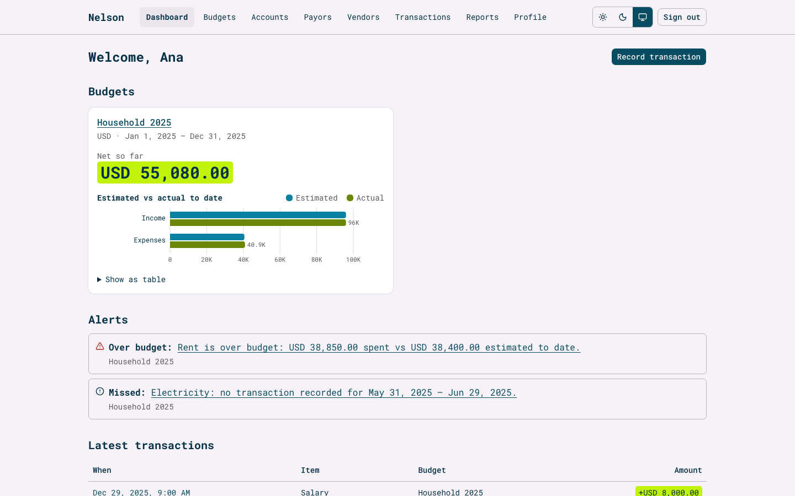
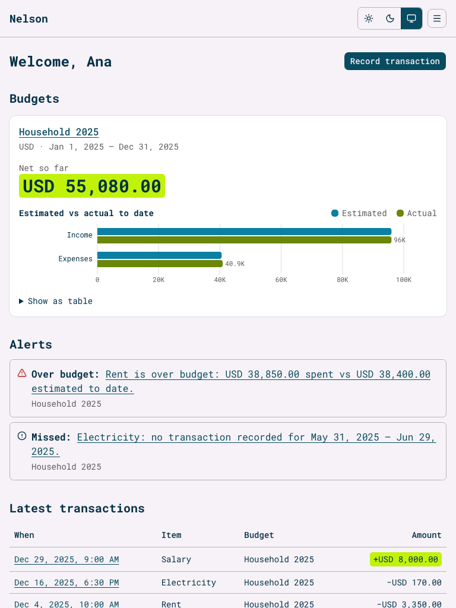
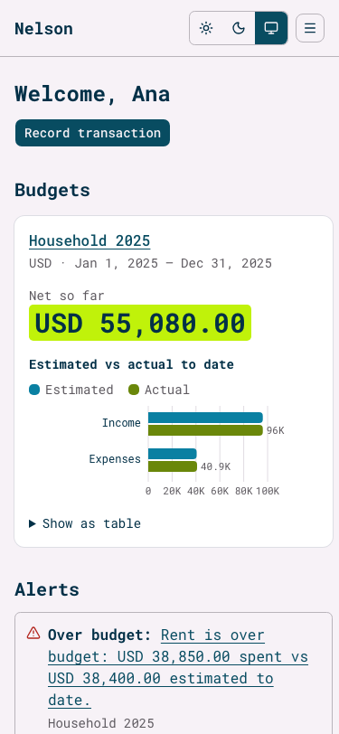
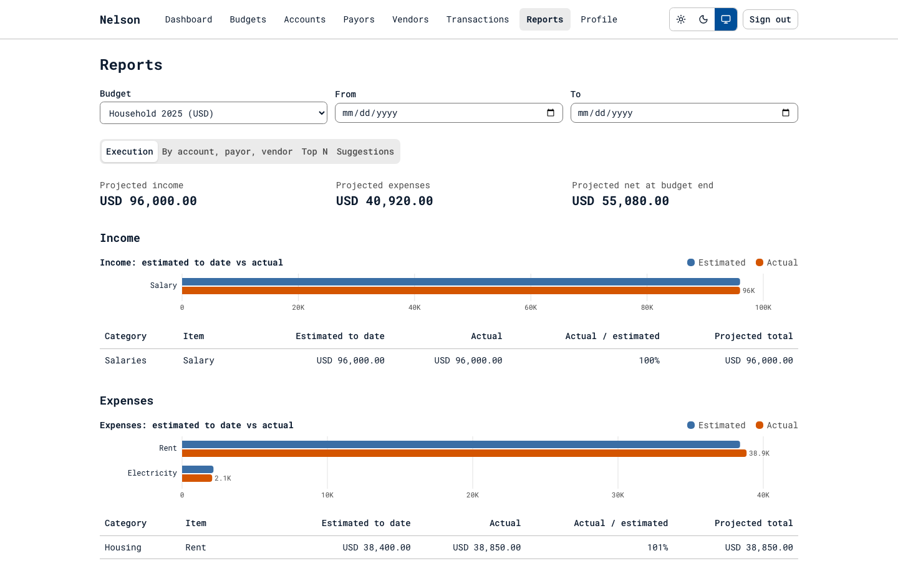
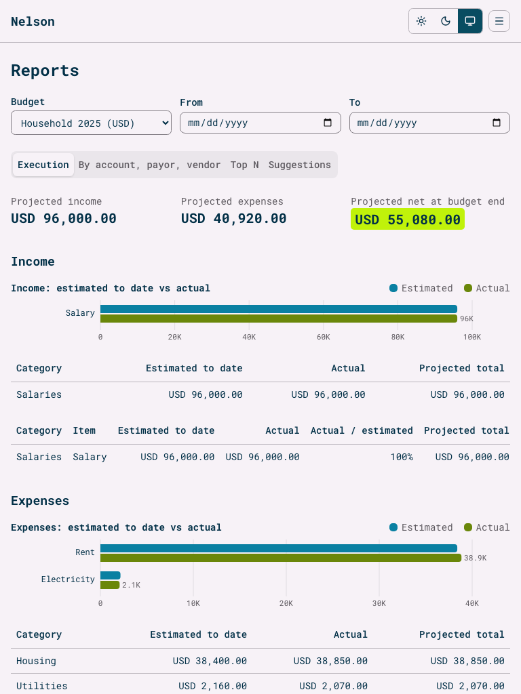
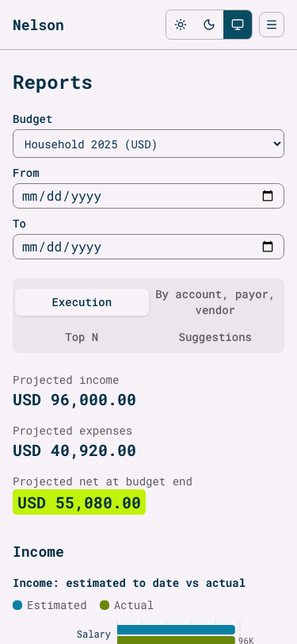

# Nelson — Budget Control (web app)

Plan a personal budget per currency, record every income and expense, and see — period by period — whether you're on track, where you'll end up, and what to change next time.

**Live:** https://fsdev-nelson-budget-frontend.vercel.app · **API repo:** [fsdev-nelson-budget-backend](https://github.com/gusanchefullstack/fsdev-nelson-budget-backend)


## Table of Contents

- [Why Nelson?](#why-nelson)
- [Features](#features)
- [Screenshots](#screenshots)
- [Installation](#installation)
- [Usage](#usage)
- [Configuration](#configuration)
- [Project Structure](#project-structure)
- [Tests](#tests)
- [What I learned](#what-i-learned)
- [Roadmap](#roadmap)
- [Contributing](#contributing)
- [License](#license)
- [Credits](#credits)
- [Author](#author)

## Why Nelson?

Spreadsheets tell you what you spent, not whether each bill landed when and for what you expected. Nelson turns every budget item into **periods ("buckets")** — rent due on the 20th becomes twelve windows from the 5th to the 4th — and drops each transaction into its window. That makes missed payments, overspending and a realistic end-of-budget forecast fall out automatically.

## Features

- **Accounts** — sign-up with a full profile, sign-in by email or username, password reset by email, lockout after repeated failures, editable email and per-user timezone.
- **Budgets in three modes** — *Lite* (basics first), *Guided* (six-step wizard) and *Complete* (one-screen tree with drag and drop plus a keyboard "Move to" menu). One budget per currency per period.
- **Items and buckets** — one-time, daily, weekly, biweekly, monthly, quarterly, annual or custom frequencies; dates clamped into the budget with a notice.
- **Accounts, payors and vendors** — balances update automatically from transactions.
- **Transactions** — income (payor → account) or expense (account → vendor), recorded in your timezone and kept in it even if you move.
- **Dashboard and reports** — estimated vs actual, missed periods, over-budget expenses, projections, totals by account/payor/vendor, Top N and rule-based suggestions with recommended estimates for your next budget.
- **Accessible by default** — semantic HTML, one `<main>` per page, keyboard support, focus management, a data table behind every chart, light and dark themes built from one set of design tokens.

## Screenshots

| Desktop (1440 px) | Tablet (768 px) | Mobile (375 px) |
|---|---|---|
|  |  |  |
|  |  |  |

## Installation

**Prerequisites:** Node.js 24.x, npm, and the [backend](https://github.com/gusanchefullstack/fsdev-nelson-budget-backend) running locally on port 3000.

```bash
git clone https://github.com/gusanchefullstack/fsdev-nelson-budget-frontend.git
cd fsdev-nelson-budget-frontend
cp .env.example .env
npm install
npm run dev   # http://localhost:5173
```

## Usage

1. Open http://localhost:5173 and create an account — your device timezone is pre-filled.
2. Follow the onboarding guide: add an account, a payor, a vendor and a budget.
3. Add categories and items to the budget, then record transactions from **Record transaction**.
4. Watch the dashboard alerts and open **Reports** for the forecast and suggestions.

Vite proxies `/api/*` to the backend in development; on Vercel a rewrite does the same, so session cookies stay first-party (no CORS).

## Configuration

| Variable | Description | Required | Default |
|---|---|---|---|
| `VITE_API_PROXY_TARGET` | Backend URL the dev server proxies `/api/*` to | No | `http://localhost:3000` |

In production the backend URL lives in the `/api/:path*` rewrite in `vercel.json`.

Colors, fonts and radii are all in [`src/styles/tokens.css`](src/styles/tokens.css) — change the palette or font there and every component follows.

## Project Structure

```text
src/
├── routes/        # TanStack Router file routes (one per page)
├── features/      # auth, budgets (lite/guided/tree), items, parties, transactions, reports, profile
├── components/    # app shell, forms, charts (D3), shadcn/ui primitives
├── lib/           # API client, auth client, Temporal helpers, friendly error messages
├── stores/        # Zustand: theme and budget draft
└── styles/        # design tokens (light/dark)
e2e/               # Playwright + axe specs, run at 375/768/1440 px
tests/             # Vitest component tests
```

## Tests

Unit/component tests use **Vitest** and **Testing Library**; end-to-end tests use **Playwright** with **axe-core**, at 375, 768 and 1440 px.

```bash
npm test                                  # component tests
npm run test:e2e                          # full e2e suite (starts frontend + backend)
npx playwright test e2e/budgets.spec.ts   # a single spec
npx playwright test -c playwright.live.config.ts e2e/entities.spec.ts   # smoke test the live site
```

## What I learned

- **Spec-driven development** with [GitHub Spec Kit](https://github.github.com/spec-kit/): constitution → spec → clarify → plan → tasks → analyze → implement. The analysis step caught a forecast that counted paid periods twice before any code existed.
- **First-party cookies across two Vercel projects.** `vercel.app` is on the Public Suffix List, so two subdomains are different *sites*; a Vercel [rewrite](https://vercel.com/docs/rewrites) keeps auth cookies first-party without CORS. I verified in production that the client IP still reaches the backend through the rewrite.
- **Temporal API** ([MDN](https://developer.mozilla.org/en-US/docs/Web/JavaScript/Reference/Global_Objects/Temporal)) via `temporal-polyfill` until Safari ships it: `PlainDate` for budget dates, `ZonedDateTime` for transactions, explicit handling of DST gaps.
- **Accessible charts** — validated a CVD-safe palette against both themes, kept identity off color alone (legend + table) and learned why scrollable tables must be focusable regions.
- **Focus management in SPAs** — moving focus to `<main>` after client-side navigation, and making sure a mobile menu sheet can't leave the page inert.
- **dnd-kit collision detection** — pointer-based collision instead of rectangle overlap made drops land where users expect.

## Roadmap

- [x] v0.1 — budgets, buckets, transactions, dashboard, reports, suggestions
- [ ] v0.5 — receipt upload with AI extraction, alert thresholds and notifications
- [ ] v0.8 — bank aggregator integration (e.g. Plaid), smart advisor
- [ ] v1.0 — more currencies, multi-language, mobile apps, admin roles

## Contributing

1. Fork the repo and create a branch: `feat/short-description` or `fix/short-description`.
2. Use [Conventional Commits](https://www.conventionalcommits.org/) (`feat:`, `fix:`, `docs:`, `test:`, `chore:`).
3. Run `npm run lint && npm run typecheck && npm test` and the relevant e2e specs.
4. Open a pull request describing the change and how you tested it.

## License

Distributed under the MIT License. See [LICENSE](./LICENSE) for details.

## Credits

[React](https://react.dev), [TanStack Router & Query](https://tanstack.com), [shadcn/ui](https://ui.shadcn.com) on [Base UI](https://base-ui.com), [Tailwind CSS](https://tailwindcss.com), [Zustand](https://zustand.docs.pmnd.rs), [Zod](https://zod.dev), [D3](https://d3js.org), [dnd-kit](https://dndkit.com), [Stepperize](https://stepperize.com), [Better Auth](https://better-auth.com), [temporal-polyfill](https://github.com/fullcalendar/temporal-polyfill), [Roboto Mono](https://fonts.google.com/specimen/Roboto+Mono). Palette from [Coolors](https://coolors.co/palette/ff6700-ebebeb-c0c0c0-3a6ea5-004e98).

## Author

**Gustavo Sanchez**

[](https://www.linkedin.com/in/gustavosanchezgalarza/) [](https://github.com/gusanchefullstack) [](https://hashnode.com/@gusanchedev) [](https://x.com/gusanchedev) [](https://bsky.app/profile/gusanchedev.bsky.social) [](https://www.freecodecamp.org/gusanchedev) [](https://www.frontendmentor.io/profile/gusanchefullstack)
